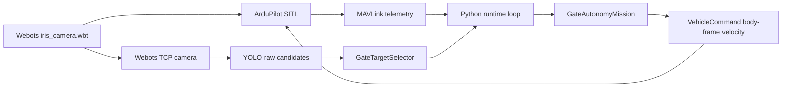

# Webots ArduPilot Autonomous Drone

[](pyproject.toml)
[](docs/setup-webots-ardupilot.md)
[](docs/run-simulation.md)
[](docs/webots-yolo-pipeline.md)
[](docs/deployment-raspi.md)

Python companion autonomy stack for a two-gate drone mission using Webots,
ArduPilot SITL, MAVLink, YOLO gate perception, and image-based visual servoing.

The current implementation is simulation-first. Raspberry Pi hardware
deployment is being prepared as a dry-run scaffold, but real C920/OpenCV
perception and flight validation are still future work.

## Mission

```text
takeoff -> seek gate 1 -> center dwell + clearance -> pass gate 1
        -> clear forward + acquire gate 2 -> brake
        -> center dwell + clearance -> pass gate 2
        -> forward exit 2 m -> brake -> land
```

The final exit distance is forward travel after gate 2, not altitude. Takeoff
altitude control is delegated to ArduPilot through guided takeoff, not a
companion-side vertical velocity bootstrap.

## Architecture



Core boundaries:

- Mission logic is deterministic, I/O-free, and consumes only fused telemetry
  plus `GateDetection | None`.
- Perception validates and tracks gate candidates before publishing one selected
  target.
- MAVLink command sending happens only in the runtime/adapter layer.
- Sensor fusion belongs to ArduPilot EKF, not the Python mission state machine.

## Quick Start: Current Simulation

Ubuntu 24.04 is the intended runtime for Webots and ArduPilot SITL.

```bash
python3 -m venv .venv
source .venv/bin/activate
pip install --upgrade pip
pip install -e ".[dev,vision]"
```

Create local SITL config:

```bash
cp configs/sitl_webots.env.example configs/sitl_webots.env
nano configs/sitl_webots.env
```

Typical terminal layout:

```bash
# Terminal 1, optional monitoring
cd MissionPlanner/
mono MissionPlanner.exe

# Terminal 2
webots webots/worlds/iris_camera.wbt

# Terminal 3
scripts/run_sitl_webots.sh

# Terminal 4, dry-run first
WEBOTS_DIAGNOSTICS_WINDOW=1 SEND_COMMANDS=0 bash scripts/run_iris_camera_yolo.sh

# SITL motion only after diagnostics are correct
WEBOTS_DIAGNOSTICS_WINDOW=1 SEND_COMMANDS=1 bash scripts/run_iris_camera_yolo.sh
```

Mission Planner should consume `udp:127.0.0.1:14550`. The autonomy runtime
should use the extra SITL output `udp:127.0.0.1:14551`.

## Raspberry Pi Scaffold

Hardware deployment is intentionally fail-closed for now.

```bash
cp configs/raspi_runtime.env.example configs/raspi_runtime.env
nano configs/raspi_runtime.env
bash scripts/run_raspi_hardware.sh
```

Default hardware assumptions:

- Pixhawk USB serial: `/dev/ttyACM0`
- fallback device to try manually: `/dev/ttyACM1`
- serial baud: `115200`
- detector: `none` until the real C920/OpenCV adapter is implemented
- command mode: `SEND_COMMANDS=0`

Read [docs/deployment-raspi.md](docs/deployment-raspi.md) before any real
hardware test.

## Mathematical Foundation

The current controller is filtered proportional visual servoing, not PID, MPC,
LQR, or feed-forward control. The mathematical contract is documented in
[docs/mathematical-foundations.md](docs/mathematical-foundations.md), including:

- normalized image error from YOLO bounding boxes,
- image-space area readiness,
- selector scoring for near/centered/stable gates,
- low-pass filtered velocity commands,
- clearance inequalities before gate pass,
- forward-distance pass and brake ramp behavior.

## Repository Layout

```text
.
+-- AGENTS.md                # AI-agent and maintainer guardrails
+-- configs/                 # Tracked env templates; local env files are ignored
+-- docs/                    # Runbooks, tuning, strategy, math, deployment
+-- models/                  # Local YOLO model artifacts
+-- scripts/                 # SITL, simulation, probe, and hardware scaffold scripts
+-- src/drone_autonomy/      # Python autonomy package
+-- tests/                   # Unit tests for local autonomy code
+-- webots/                  # Vendored ArduPilot Webots_Python baseline assets
```

## Primary Docs

- [docs/project-status.md](docs/project-status.md): implementation truth source
  for humans and AI agents.
- [docs/run-simulation.md](docs/run-simulation.md): exact simulation workflow.
- [docs/tuning-guide.md](docs/tuning-guide.md): operator tuning reference.
- [docs/webots-yolo-pipeline.md](docs/webots-yolo-pipeline.md): camera to YOLO
  to target selector pipeline.
- [docs/mathematical-foundations.md](docs/mathematical-foundations.md):
  scientific model of the implemented behavior.
- [docs/deployment-raspi.md](docs/deployment-raspi.md): Raspberry Pi staged
  deployment plan.
- [docs/sensor-fusion-and-altitude.md](docs/sensor-fusion-and-altitude.md):
  EKF ownership and altitude policy.
- [docs/troubleshooting.md](docs/troubleshooting.md): common failures and fixes.

## Current Status

Implemented:

- Webots + ArduPilot SITL baseline assets.
- MAVLink telemetry and body-frame command adapter.
- Two-gate mission state machine.
- ArduPilot-managed guided takeoff.
- Webots TCP camera client with `rgb24` support.
- YOLOv8n gate detector wrapper and class filtering.
- `GateTargetSelector` validation, scoring, tracking, and smoothing.
- OpenCV diagnostics overlay for simulation tuning.
- Raspberry Pi dry-run deployment scaffold.

Not implemented yet:

- validated real Logitech C920 camera adapter,
- real hardware flight procedure,
- hardware failsafe/retry policy,
- competition-grade two-gate Webots course,
- metric distance estimation from RGB.

## Ownership Rule

Do not modify ArduPilot source unless there is a clear simulator integration
requirement. Prefer local config files, launch scripts, and companion-app code
inside this repository.
