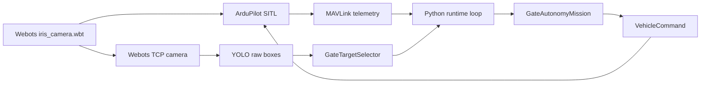

# Webots ArduPilot Autonomous Drone

[](pyproject.toml)
[](docs/setup-webots-ardupilot.md)
[](docs/run-simulation.md)
[](docs/webots-yolo-pipeline.md)
[](docs/deployment-raspi.md)

This repository contains a Python companion-autonomy stack for a drone that
must pass through two hollow gates and then land. The current workflow is built
around Webots, ArduPilot SITL, MAVLink, a YOLO gate detector, and image-based
visual servoing.

The project is intentionally simulation-first. The Raspberry Pi 5 path exists
for dry-run preparation, camera diagnostics, and model export work, but it is
not a validated real-flight launcher yet.

## Mission Flow

```text
takeoff
-> seek gate 1
-> center dwell + clearance check
-> pass gate 1
-> clear forward while acquiring gate 2
-> brake
-> center dwell + clearance check
-> pass gate 2
-> fly forward 2 m
-> brake
-> land
```

Important details:

- The final `2 m` segment is forward travel after gate 2, not altitude.
- Takeoff altitude control is delegated to ArduPilot guided takeoff.
- The companion code outputs body-frame commands; ArduPilot handles the low
  level vehicle stabilization.
- Sensor fusion for GPS/rangefinder/optical-flow belongs to ArduPilot EKF. This
  repo consumes fused MAVLink telemetry instead of raw-blending sensors in
  Python.

## Current Status

Implemented:

- Webots + ArduPilot SITL launcher flow.
- Two-gate mission state machine.
- MAVLink telemetry and body-frame command adapter.
- `COMMAND_ACK` retry/fail-closed handling plus accepted-command
  deduplication for arm, takeoff, and land.
- Webots TCP camera reader for `iris_camera.wbt`.
- YOLO gate detector wrapper with fail-closed class filtering.
- Fail-closed camera/inference progress monitoring that pauses mission updates
  when perception workers or frames become stale.
- `GateTargetSelector` for target validation, tracking, and smoothing.
- OpenCV diagnostics overlay for simulation tuning.
- Raspberry Pi 5 dry-run scaffold.
- Logitech C920/OpenCV frame source for dry-run diagnostics.
- NCNN export helper for Raspberry Pi model preparation.
- Offline preflight checker and optional JSONL runtime logs.

Not validated yet:

- Real-flight behavior on the physical hexacopter.
- Real C920/NCNN inference performance on Raspberry Pi 5.
- Hardware safety procedure for command-sending tests.
- Competition-grade custom two-gate Webots course.
- Metric distance estimation from a single RGB camera.

## System Overview


```mermaid
flowchart LR
  W["Webots iris_camera.wbt"] --> AP["ArduPilot SITL"]
  AP --> ML["MAVLink telemetry"]
  ML --> RT["Python runtime loop"]
  W --> CAM["Webots TCP camera"]
  CAM --> YOLO["YOLO raw boxes"]
  YOLO --> SEL["GateTargetSelector"]
  SEL --> RT
  RT --> M["GateAutonomyMission"]
  M --> C["VehicleCommand"]
  C --> AP
```

The same mission code is meant to survive the transition from simulation to
hardware. Only the adapters should change:

- simulation camera: `webots-yolo`
- Raspberry Pi camera: `opencv-yolo`
- mission input: always `GateDetection | None`
- mission output: always `VehicleCommand`

## Model Path And Class Filter

The current simulation model path is:

```text
models/gate_yolov8n_best.pt
```

The current known class map is:

```text
0 = AdvertisementBox
1 = Dog
2 = Forklift
3 = Goals-Detection
4 = Table
```

The gate filter should stay fail-closed:

```text
YOLO_GATE_CLASS_NAMES="Goals-Detection"
YOLO_GATE_CLASS_IDS="3"
```

Do not clear both filters during motion tests. If Dog, Forklift, Table, or other
objects appear as the selected target, inspect the diagnostics line that shows
raw YOLO classes before changing mission logic.

## Simulation Setup

Ubuntu 24.04 is the intended OS for Webots + ArduPilot SITL development.

Install the Python package from the repo root:

```bash
python3 -m venv .venv
source .venv/bin/activate
pip install --upgrade pip
pip install -e ".[dev,vision]"
```

Create local SITL config:

```bash
cp configs/sitl_webots.env.example configs/sitl_webots.env
nano configs/sitl_webots.env
```

Create a local autonomy config only when you want persistent tuning:

```bash
cp configs/autonomy_runtime.env.example configs/autonomy_runtime.env
nano configs/autonomy_runtime.env
```

Check the effective simulation config before starting the run:

```bash
python scripts/preflight_check.py --profile simulation
```

Expected shape:

```text
status=ok detector=webots-yolo connection=udp:127.0.0.1:14551 send_commands=0
```

## Running The Current Simulation

Use four terminals.

Terminal 1, optional Mission Planner monitor:

```bash
cd MissionPlanner/
mono MissionPlanner.exe
```

Terminal 2, Webots:

```bash
webots webots/worlds/iris_camera.wbt
```

Terminal 3, ArduPilot SITL:

```bash
source .venv/bin/activate
scripts/run_sitl_webots.sh
```

Terminal 4, autonomy with diagnostics:

```bash
source .venv/bin/activate
WEBOTS_DIAGNOSTICS_WINDOW=1 SEND_COMMANDS=0 bash scripts/run_iris_camera_yolo.sh
```

Only after the diagnostics window shows the correct gate target in SITL:

```bash
WEBOTS_DIAGNOSTICS_WINDOW=1 SEND_COMMANDS=1 bash scripts/run_iris_camera_yolo.sh
```

Mission Planner should use `udp:127.0.0.1:14550`. The autonomy process should
use `udp:127.0.0.1:14551`.

Optional JSONL log for later analysis:

```bash
AUTONOMY_LOG_JSONL=logs/sitl-autonomy.jsonl \
WEBOTS_DIAGNOSTICS_WINDOW=1 SEND_COMMANDS=0 \
bash scripts/run_iris_camera_yolo.sh
```

## Raspberry Pi 5 Preparation

Target hardware direction:

```text
OS: Raspberry Pi OS 64-bit standard with desktop
Pixhawk USB: /dev/ttyACM0, fallback /dev/ttyACM1
Baud: 115200 unless ArduPilot serial config says otherwise
Camera: Logitech C920 Pro through OpenCV
Model runtime target: NCNN export
Default command mode: SEND_COMMANDS=0
```

Create local Raspberry Pi config:

```bash
cp configs/raspi_runtime.env.example configs/raspi_runtime.env
nano configs/raspi_runtime.env
```

Export the model for Raspberry Pi inference:

```bash
python scripts/export_yolo_ncnn.py --model models/gate_yolov8n_best.pt --imgsz 640
```

Use the exported directory as the Raspberry Pi `YOLO_MODEL_PATH` after it loads
correctly:

```text
YOLO_MODEL_PATH="${REPO_ROOT}/models/gate_yolov8n_best_ncnn_model"
```

Check the Raspberry Pi config:

```bash
python scripts/preflight_check.py --profile raspi
```

Check the C920 without MAVLink or YOLO:

```bash
python scripts/probe_opencv_camera.py --source /dev/video0 --backend v4l2
```

Check the C920 + YOLO + target selector without MAVLink:

```bash
python scripts/probe_opencv_yolo.py \
  --source /dev/video0 \
  --backend v4l2 \
  --model models/gate_yolov8n_best_ncnn_model \
  --diagnostics-window
```

Start the hardware scaffold in dry-run mode:

```bash
bash scripts/run_raspi_hardware.sh
```

Do not set `SEND_COMMANDS=1` on hardware just because SITL works. Read
[docs/deployment-raspi.md](docs/deployment-raspi.md) first.

## Tuning

Runtime tuning belongs in local env files, not in tracked examples:

```text
configs/autonomy_runtime.env   # Webots/SITL tuning
configs/raspi_runtime.env      # Raspberry Pi tuning
```

Common tuning areas:

- `YOLO_*`: model path, confidence, inference size, class filters.
- `GATE_SELECTOR_*`: target stability and geometric filtering.
- `MISSION_*`: phase timing, pass distance, acquire distance, braking.
- `VISUAL_*`: image-space centering, clearance margins, velocity limits.
- `OPENCV_*`: Raspberry Pi/C920 camera source and capture settings.

Read [docs/tuning-guide.md](docs/tuning-guide.md) before changing these values.

## Documentation Map

- [docs/project-status.md](docs/project-status.md): current implementation
  truth source.
- [docs/run-simulation.md](docs/run-simulation.md): step-by-step simulation
  runbook.
- [docs/tuning-guide.md](docs/tuning-guide.md): tuning variables and safe
  adjustment order.
- [docs/webots-yolo-pipeline.md](docs/webots-yolo-pipeline.md): camera to YOLO
  to target selection pipeline.
- [docs/mathematical-foundations.md](docs/mathematical-foundations.md):
  equations implemented by the current controller and mission policy.
- [docs/deployment-raspi.md](docs/deployment-raspi.md): Raspberry Pi staged
  deployment plan.
- [docs/sensor-fusion-and-altitude.md](docs/sensor-fusion-and-altitude.md):
  EKF ownership and altitude policy.
- [docs/troubleshooting.md](docs/troubleshooting.md): common problems and
  checks.

## Repository Layout

```text
.
+-- AGENTS.md                # Maintainer and AI-agent guardrails
+-- configs/                 # Tracked env templates; local env files are ignored
+-- docs/                    # Runbooks, tuning notes, math, deployment docs
+-- models/                  # Local YOLO model artifacts
+-- scripts/                 # Launchers, probes, export helpers
+-- src/drone_autonomy/      # Python autonomy package
+-- tests/                   # Unit tests
+-- webots/                  # Vendored ArduPilot Webots_Python baseline assets
```

## Development Boundary

Do not modify ArduPilot source unless a simulator integration issue requires it.
Prefer local env files, launch scripts, and companion-side code inside this
repository.
