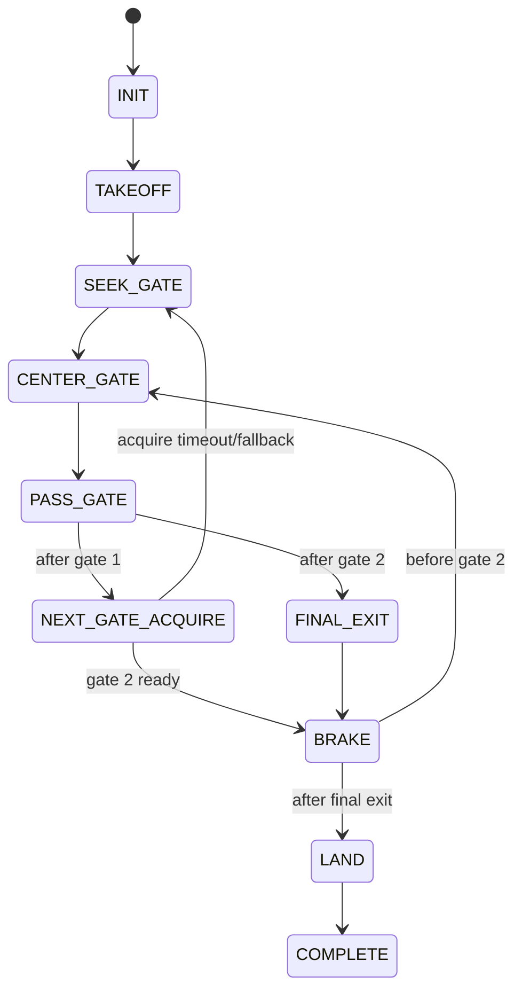

# Mathematical Foundations

This document explains the mathematical behavior implemented by the current
autonomy code. It is intentionally conservative: it describes the actual
filtered proportional visual-servo pipeline, not PID, MPC, LQR, SLAM, or metric
depth estimation.

Primary code references:

- `src/drone_autonomy/perception/target_selector.py`
- `src/drone_autonomy/control/visual_servo.py`
- `src/drone_autonomy/autonomy/mission.py`
- `src/drone_autonomy/mavlink/telemetry.py`
- `src/drone_autonomy/mavlink/commands.py`

## Coordinate Frames

The mission emits ArduPilot-friendly body-frame velocity commands:

$$
\mathbf{u}_B =
\begin{bmatrix}
v_x & v_y & v_z & \omega_z
\end{bmatrix}^{T}
$$

where:

- $v_x > 0$ means forward.
- $v_y > 0$ means right.
- $v_z > 0$ means down.
- $\omega_z > 0$ means yaw right / clockwise from the vehicle perspective.

The mission does not send raw motor, attitude, or rate commands. ArduPilot owns
the inner flight-control loops.

## Bounding-Box Geometry

For a frame with width $W$ and height $H$, a selected gate bounding box is:

$$
B = (x_{min}, y_{min}, x_{max}, y_{max})
$$

The image-space center is:

$$
c_x = \frac{x_{min} + x_{max}}{2},
\qquad
c_y = \frac{y_{min} + y_{max}}{2}
$$

The normalized center error is:

$$
e_x = \frac{c_x - W/2}{W/2},
\qquad
e_y = \frac{c_y - H/2}{H/2}
$$

Interpretation:

- $e_x > 0$: the selected gate is right of the desired image target.
- $e_y > 0$: the selected gate is below the desired image target.

The normalized bounding-box area is:

$$
a =
\frac{(x_{max}-x_{min})(y_{max}-y_{min})}{WH}
$$

This area ratio is an image-space readiness proxy only. It is not metric
distance unless camera intrinsics and real gate dimensions are calibrated.

## Target Offset and Clearance

The desired pass center can be shifted to compensate for camera mounting,
vehicle centerline, GPS mast, or frame protrusions:

$$
\tilde{e}_x = e_x - o_x,
\qquad
\tilde{e}_y = e_y - o_y
$$

where $o_x$ and $o_y$ come from:

```text
VISUAL_PASS_TARGET_OFFSET_X
VISUAL_PASS_TARGET_OFFSET_Y
```

The pass-clearance validator uses asymmetric image-space margins:

$$
-m_L \le \tilde{e}_x \le m_R
$$

$$
-m_U \le \tilde{e}_y \le m_D
$$

where the margins are:

```text
VISUAL_PASS_CLEARANCE_LEFT
VISUAL_PASS_CLEARANCE_RIGHT
VISUAL_PASS_CLEARANCE_UP
VISUAL_PASS_CLEARANCE_DOWN
```

These inequalities define the magenta diagnostics box in the OpenCV overlay.
They are not obstacle avoidance by themselves; they are the configurable visual
alignment condition before the committed pass.

## Low-Pass Filtering

The visual servo uses exponential smoothing for image errors, area ratio, and
velocity commands:

$$
\hat{x}_t = \alpha x_t + (1-\alpha)\hat{x}_{t-1}
$$

Image geometry uses `VISUAL_FILTER_ALPHA`; command output uses
`VISUAL_COMMAND_FILTER_ALPHA`.

Lower $\alpha$ gives smoother but slower response. Higher $\alpha$ gives faster
but jerkier response.

## Deadband

Small image errors are suppressed so detector jitter does not produce constant
motion:

$$
D(e,\delta)=
\begin{cases}
0, & |e| \le \delta \\
e - \operatorname{sgn}(e)\delta, & |e| > \delta
\end{cases}
$$

The deadbands are:

```text
VISUAL_CENTER_DEADBAND_X
VISUAL_CENTER_DEADBAND_Y
```

## Filtered Proportional Visual Servoing

The current controller is proportional control with deadband, saturation, and
low-pass filtering. It is not PID.

Before command filtering, the lateral, vertical, and yaw corrections are:

$$
v_y =
\operatorname{clip}
\left(
k_y D(\tilde{e}_x,\delta_x),
-v_{y,max},
v_{y,max}
\right)
$$

$$
v_z =
\operatorname{clip}
\left(
k_z D(\tilde{e}_y,\delta_y),
-v_{z,max},
v_{z,max}
\right)
$$

$$
\omega_z =
\operatorname{clip}
\left(
k_{\psi} D(\tilde{e}_x,\delta_x),
-\omega_{max},
\omega_{max}
\right)
$$

The sign convention matches the code:

- gate right of target means move/yaw right,
- gate below target means move down.

The tunable gains and limits are:

```text
VISUAL_LATERAL_KP
VISUAL_VERTICAL_KP
VISUAL_YAW_KP
VISUAL_MAX_LATERAL_SPEED
VISUAL_MAX_VERTICAL_SPEED
VISUAL_MAX_YAW_RATE
```

## Forward Speed During Centering

The controller approaches slowly only when the gate is reasonably centered:

$$
e_{max} = \max(|\tilde{e}_x|, |\tilde{e}_y|)
$$

If $e_{max} \ge e_f$, then:

$$
v_x = 0
$$

Otherwise:

$$
q = 1 - \frac{e_{max}}{e_f}
$$

$$
v_x = v_{min} + q(v_{max}-v_{min})
$$

The related variables are:

```text
VISUAL_MAX_ERROR_FOR_FORWARD
VISUAL_MIN_FORWARD_SPEED
VISUAL_MAX_FORWARD_SPEED
```

Committed gate crossing uses a different phase, `PASS_GATE`, with stable
forward-only velocity.

## Target Selection Score

YOLO produces raw `GateCandidate` objects. `GateTargetSelector` filters and
scores them before publishing one stable `GateDetection`.

The selector rejects candidates using:

- class filtering in `YoloGateDetector`,
- minimum confidence,
- area range,
- aspect-ratio range,
- ROI / center-error bounds,
- optional hollow-gate appearance score.

For accepted candidates, the score is:

$$
S =
w_a S_a
+ w_c S_c
+ w_p S_p
+ w_l S_l
+ w_g S_g
$$

where:

$$
S_a = \min\left(1, \frac{a}{a_{target}}\right)
$$

$$
S_c =
1 -
\min\left(
1,
\frac{\sqrt{e_x^2+e_y^2}}{\sqrt{2}}
\right)
$$

$$
S_p = p
$$

$$
S_l = \operatorname{IoU}(B_{previous}, B_{current})
$$

$$
S_g =
\begin{cases}
\text{hollow-gate appearance score}, & \text{if available} \\
0, & \text{otherwise}
\end{cases}
$$

Default score weights in the current code:

```text
area_weight=0.52
center_weight=0.26
confidence_weight=0.12
lock_weight=0.10
appearance_weight=0.00
```

During tracking, some area weight is shifted into lock weight. This is why the
selector can prefer larger/nearer gates while still resisting target jumps once
a gate is already locked.

## Mission Phase Logic

The high-level state machine is deterministic:



Gate pass commit requires all of:

$$
t_{center} \ge T_{dwell}
$$

$$
t_{clearance} \ge T_{clearance}
$$

$$
a \ge a_{ready}
$$

These correspond to:

```text
MISSION_CENTER_DWELL
MISSION_CENTER_CLEARANCE_REQUIRED
MISSION_GATE_READY_AREA
```

## Forward-Distance Segments

The mission uses fused local-position telemetry projected onto the configured
course-forward axis. With `LOCAL_POSITION_NED` position $(x,y)$ and normalized
course vector $(d_x,d_y)$:

$$
s = x d_x + y d_y
$$

This projected forward distance drives:

- gate pass distance,
- gate-2 clear distance,
- gate-2 acquire maximum distance,
- final forward exit after gate 2.

The projection vector is configured with:

```text
COURSE_FORWARD_X
COURSE_FORWARD_Y
```

## Brake Ramp

`BRAKE` ramps the previous forward speed to zero instead of stepping abruptly:

$$
v_x(t) =
v_{x,0}
\max\left(0, 1 - \frac{t}{T_b}\right)
$$

where $T_b$ is:

```text
MISSION_BRAKE_RAMP
```

The brake phase then waits for:

```text
MISSION_BRAKE_SETTLE
```

Companion altitude correction during brake is disabled by default:

```text
MISSION_BRAKE_ALTITUDE_HOLD=0
```

That default avoids vertical bounce from a companion-side altitude correction
fighting the vehicle pitch/altitude transient during deceleration.

## Altitude Bias Outside Brake

When altitude correction is active in velocity phases, the mission uses fused
telemetry from the adapter. It does not raw-blend GPS, rangefinder, or optical
flow.

A simplified proportional altitude bias is:

$$
e_h = h^* - h
$$

$$
v_z^{alt} =
\operatorname{clip}
\left(
-k_h D(e_h,\delta_h),
-v_{climb,max},
v_{desc,max}
\right)
$$

The negative sign is because the internal body $z$ axis is positive down:
positive altitude error means the vehicle is below target and should command
negative $v_z$ to climb.

## What This Model Does Not Claim

The current implementation does not provide:

- metric distance from RGB-only gate bounding boxes,
- obstacle avoidance outside the image-space clearance validator,
- PID / feed-forward visual servoing,
- MPC or LQR control,
- local SLAM,
- companion-side raw fusion of GPS, rangefinder, and optical flow.

Those can be future research extensions, but they should not be described as
implemented behavior until code and tests exist.
